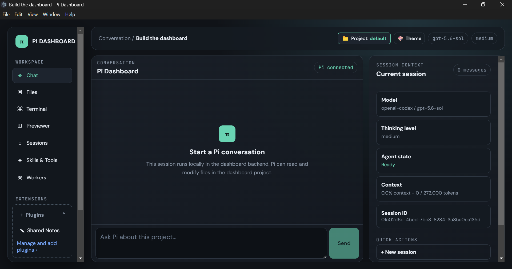

<div align="center">

# 🚀 Pi Dashboard
### Next-Generation Native Desktop Agent Workspace & Multi-Provider Coordinator

[](https://focidashboard.dev/)
[](./LICENSE)
[]()
[]()
[]()
[]()

<p align="center">
  <b>A powerful, privacy-first desktop environment orchestrating the Pi Coding Agent alongside Google Antigravity, OpenAI Codex, and Anthropic Claude.</b><br/>
  🌐 <a href="https://focidashboard.dev/"><b>focidashboard.dev</b></a> — Official website, documentation, and user guides.
</p>



</div>

---

## ✨ Key Features

### 🤖 Autonomous Multi-Provider Worker Suite
* **Native CLI Adapters**: Direct execution integration with **Sub-PI**, **Google Antigravity CLI** (`agy`), **OpenAI Codex CLI** (`codex`), and **Anthropic Claude CLI** (`claude`).
* **Dynamic Bounds**: Custom sliders for turn limits (1–32), timeouts (1–60m), and result payload limits.
* **Embedded CLI Console**: Built-in terminal session for running account authentication (`codex login`, `claude login`, `agy`) and tool discovery.

### 📜 2-Level Markdown Rules & Router
* **Level 1 Delegation Router (`WORKERS.md`)**: Defines provider specializations, routing guidelines, and available host tools (`gh`, `rg`, `uv`, `npm`).
* **Level 2 Provider Rules (`rules/*.md`)**: Tailored operational instructions for each model provider, editable in real-time in the in-app dual-pane editor.

### ◫ Live Web & HTML App Previewer
* **Workspace HTML Discovery**: Automatic dropdown and direct static file serving (`/api/preview/workspace/*`) for testing local `.html` files without running external servers.
* **Local Dev Server Tunneling**: Instant preview presets for Vite (`:5173`), Next/React (`:3000`), Local (`:8080`), and custom ports with live hot-reloading.
* **Responsive Viewport Frames**: Test layouts across **🖥 Desktop (Full Width)**, **📱 Tablet (768px with bezel)**, and **📲 Mobile (375px phone frame)**.

### 🎛️ Modular Experience Stacks & Feature Checklists
* **One-Click Presets**:
  * **`★ User / Basic`**: Clean and focused. Core chat, file browser, terminal, and Sub-PI solo worker.
  * **`⚡ Developer`**: Full-stack dev mode. Multi-agent CLIs (Antigravity & Codex), Markdown Rules editor, and App Previewer.
  * **`🏢 Business`**: Advanced automations, Claude CLI, and scheduled background tasks.
* **Granular Feature Checklists**: Check or uncheck any individual feature or worker provider in Settings with instant live saving.

### 💬 Intelligent Multi-Model Chat
* Streaming conversations with Claude, GPT, OpenRouter, Gemini, and local Ollama models.
* Real-time visual code diffs, interactive branch trees, and session compaction.

### 📁 File Explorer & Syntax-Highlighted Editor
* Clean file browser with CodeMirror syntax highlighting, line numbers, and live file saving.
* Preserves git state indicators (modified, added, untracked) for all workspace files.

### ⚡ Native Terminal with PTY Bridge
* Embedded pseudo-terminal powered by `node-pty`.
* Direct PowerShell, Command Prompt, or Git Bash execution with full ANSI color support.

### 🔒 Strict Workspace Confinement
* Enforces that all generated files, edits, and worker artifacts remain confined within your active project workspace.

### 🌐 Private Remote Pairing with Tailscale Serve
* Control your dashboard securely from your phone, tablet, or remote laptop over your encrypted Tailnet (`https://<machine>.tailnet.ts.net:8443`) with custom password authentication.

---

## 🛠️ Quick Start

### Prerequisites
* [Node.js](https://nodejs.org/) (v20 or newer)
* [Git](https://git-scm.com/)

### Installation & Launch

```powershell
# Clone the repository
git clone https://github.com/mwiltb-design/pi-dashboard.git Pi-Dashboards
cd Pi-Dashboards

# Launch developer desktop environment (auto-installs dependencies)
.\scripts\dev.ps1
```

*(On macOS or Linux, run `./scripts/dev.sh`)*

---

## 📁 Architecture Overview

```
Pi-Dashboards/
├── electron/          # Native Electron shell & window manager
├── server/            # Backend API, RPC process runner & PTY bridge
│   ├── docs/          # Built-in documentation (abilities, limits, shortcuts)
│   ├── skills/        # Built-in agent lookup skills
│   ├── src/           # Adapters for Sub-PI, Antigravity, Codex, and Claude
│   └── templates/     # Clean starter project templates (MEMORY.md)
├── ui/                # React + Vite frontend application
│   ├── src/components # Previewer, Worker Console, Stack Selector, Editor
│   └── src/views      # Dashboard view routing
├── packages/          # Shared plugin-sdk
└── scripts/           # Platform launch and build scripts
```

---

## ⚙️ Configuration & Zero Collisions

* **Default Ports:** UI on `127.0.0.1:5173` and Backend on `127.0.0.1:4317`.
* **Zero Collisions:** Multi-window instances dynamically hunt the next open ports (`5174`, `4318`, etc.).
* **Zero Manual File Editing:** Configure your settings, experience stacks, worker rules, and Tailscale password directly in the dashboard UI.

---

## 📜 License

This project is licensed under the **GNU General Public License v3.0 (GPLv3)**. See the [LICENSE](./LICENSE) file for details.

Created with ❤️ by [mwiltb-design](https://github.com/mwiltb-design).
